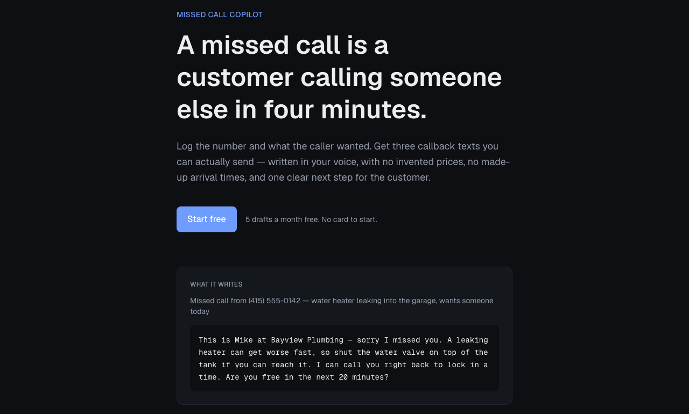

# Missed Call Copilot

A small business misses a call, logs the number and what the caller wanted, and gets three
send-ready callback texts written by Claude — with an urgency read on the call and no
invented prices, arrival times, or availability.

**Live:** https://ai-recep-starter.vercel.app — sign up with any email, 5 free drafts.



## What it actually produces

Real output from the live app, not a mockup. Input was a voicemail note:
*"pipe burst under the kitchen sink, water all over the floor, she shut the main off.
Asking how soon someone can come out and what it'll cost."*

It tagged the call **Emergency**, summarized it as *"Burst pipe under kitchen sink flooded
the floor; main is shut off, she wants an ETA and cost,"* and wrote three drafts. The direct one:

> Got your voicemail about the burst pipe under the kitchen sink. Call me back now and I'll
> get you scheduled. Good call shutting the main off - leave it off. Can you tell me if the
> water is still spreading and whether it has reached any walls or cabinets? I'll quote once
> I see the pipe.

The caller asked what it would cost. All three drafts decline to guess — *"I'll quote once I
see the pipe"* — and none promise an arrival time. That's the constraint from the system
prompt holding under a request specifically designed to pull a number out of it.

## Why this exists

I sell AI voice agents to small trade businesses — plumbing, HVAC, locksmith, restoration.
The single thing every one of them says out loud is that a missed call is a lost job,
because the caller dials the next result within a few minutes. Most of them already know
they should text back. What stops them is sitting down to write it while they're under a
sink.

So this is the smallest useful version of the thing they actually asked for: the writing
part, without the phone system.

## What's in it

| Piece | Where |
|---|---|
| Email + password auth, session refresh, protected routes | `src/lib/supabase/`, `src/proxy.ts` |
| Postgres tables with row level security | `supabase/schema.sql` |
| The Claude call — structured output, typed with Zod | `src/app/api/draft/route.ts` |
| Stripe subscription checkout | `src/app/api/checkout/route.ts` |
| Stripe webhook, signature-verified, flips the plan | `src/app/api/stripe/webhook/route.ts` |
| Dashboard, quota meter, copy-to-clipboard drafts | `src/app/dashboard/` |

Free plan is 5 drafts a month; Pro is unlimited.

## Decisions worth explaining

**The model isn't allowed to make things up.** The system prompt forbids inventing a price,
an arrival time, a technician name, or an availability slot, and requires every draft to end
in a concrete next step. A callback text that promises "someone will be there by 3" when
nobody will is worse for the business than no text at all — it converts a missed call into
an angry customer.

**The response is a typed schema, not prose.** `messages.parse()` with a Zod schema
(`output_config.format`) returns an urgency level, a one-line summary, and exactly three
drafts in fixed tones. Parsing free text for "the three drafts" would break the first time
the model formatted a list differently; this can't drift, and `parsed_output` is typed all
the way into the React component.

**Quota is enforced on the server, before the model call.** The client hides the button at
zero, but that's cosmetic — `/api/draft` re-reads usage from the database and returns 402
regardless of what the browser believes. Anything else means a free account can spend my
API budget with a `fetch` in the console.

**Row level security is the real access control, not the app code.** Every policy in
`schema.sql` keys on `auth.uid()`, so even the anon key the browser holds can't read another
user's calls. The app's own checks are a second layer, not the boundary.

**One route uses the service-role key, and only one.** The Stripe webhook writes a plan
change for a user who isn't the one making the request, so it has to bypass RLS. That's safe
specifically because `constructEventAsync` verifies the Stripe signature first — an unsigned
or replayed body is rejected before any database call. The webhook path is also excluded
from the proxy matcher, since it carries no session cookie and its raw body has to arrive
byte for byte.

**Sessions refresh in `proxy.ts`, but it doesn't do the authorizing.** Next 16 renamed
Middleware to Proxy; this one exists to rotate the Supabase cookie so users aren't silently
logged out. Every page and route still checks the session itself. Making the proxy the
gatekeeper would put the whole app behind one matcher regex.

## Running it locally

```bash
npm install
cp .env.example .env.local     # fill in the values below
npm run dev
```

You need four things:

1. **A Supabase project.** Run `supabase/schema.sql` in the SQL editor, then copy the URL,
   anon key, and service-role key from Project Settings → API. For a demo account, turn off
   Authentication → Sign In / Providers → **Confirm email**, so sign-up logs you straight in.
2. **An Anthropic API key** from console.anthropic.com.
3. **Stripe test keys** and a recurring price id. Test mode only — card `4242 4242 4242 4242`.
4. **A webhook secret.** Locally: `stripe listen --forward-to localhost:3000/api/stripe/webhook`.
   Deployed: add the endpoint in the Stripe dashboard and copy its signing secret.

Without Stripe the app runs fine — upgrading just returns "Stripe isn't configured."

## Deploying

Vercel, with the same environment variables. The Stripe webhook endpoint points at
`https://<your-domain>/api/stripe/webhook`. `SUPABASE_SERVICE_ROLE_KEY` must not be prefixed
`NEXT_PUBLIC_` anywhere — it bypasses RLS.

## Stack

Next.js 16 (App Router, Server Components) · TypeScript · Tailwind v4 · Supabase (Postgres,
Auth, RLS) · Claude via `@anthropic-ai/sdk` · Zod · Stripe

## Status

Deployed and verified end to end against live services: sign-up creates the account and its
profile row, the quota decrements, Claude returns structured drafts, and the row persists and
renders. Auth gating is verified too — unauthenticated `/dashboard` redirects to `/login` and
unauthenticated `POST /api/draft` returns 401.

Stripe is wired but not exercised; checkout needs test keys set, and without them the app
reports "Stripe isn't configured" rather than breaking.

`GET /api/health` reports the serving commit and whether each integration resolves — booleans
only, no values. It exists because diagnosing this deployment through a CDN was otherwise
guesswork: a cached page from an older build is indistinguishable from a new build that can't
see its credentials.

### A deployment note worth keeping

Vercel withholds **Sensitive** environment variables during the build, and Next.js inlines
`process.env.NEXT_PUBLIC_*` at build time. A `NEXT_PUBLIC_` variable marked Sensitive
therefore compiles to `undefined` permanently even though the value exists at runtime — and
Vercel refuses to save that combination at all. Since nothing here needs the value in the
browser, `src/lib/supabase/config.ts` resolves config at runtime through a variable index the
bundler can't inline, and accepts either naming convention. The variables in production are
`SUPABASE_URL`, `SUPABASE_ANON_KEY`, and `SUPABASE_SERVICE_ROLE_KEY`, with no public prefix.
